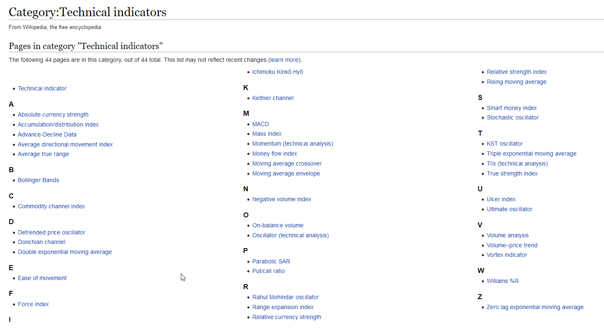
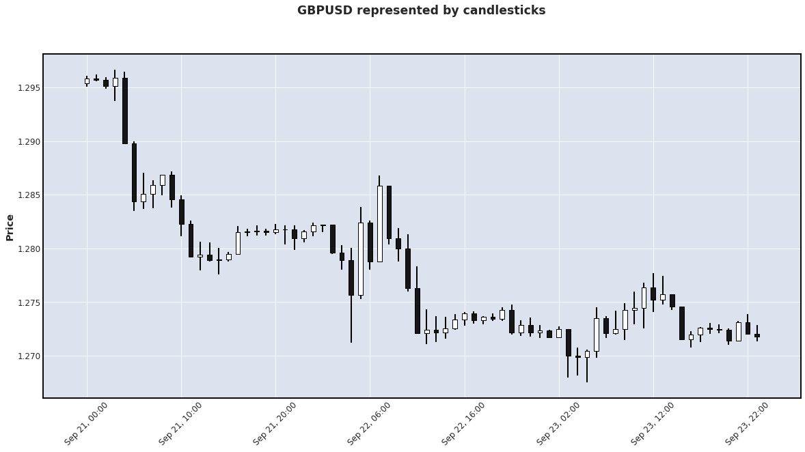
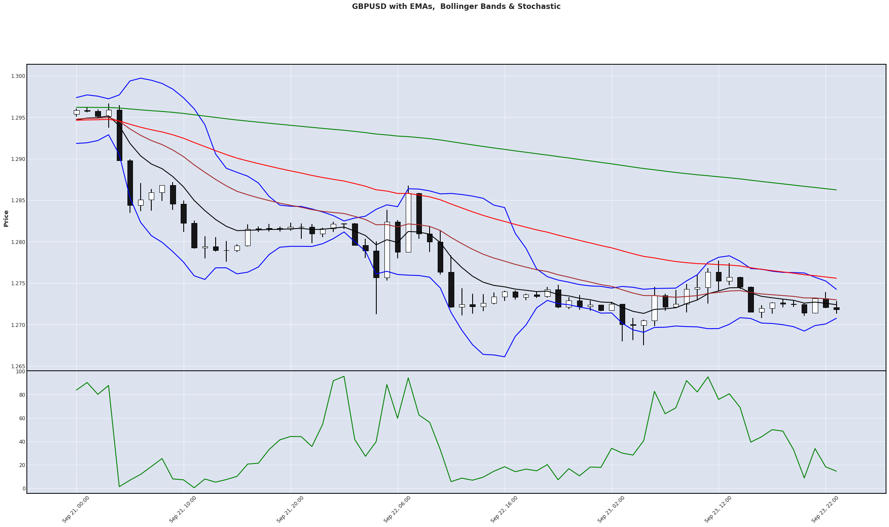
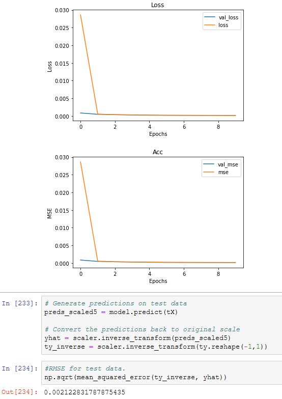

# Table of contents

- Purpose

- Synopsis

- Analysis

- Wayforward

# Purpose

Predict the closing price for the next one hour of a time-series dataset for the Pound Sterling / US Dollar (GBPUSD) foreign exchange rate. 
The price is a measure of a currency compared to a base currency. 

With GBPUSD this mean how many dollars £1 can buy.

Traders are buying and selling on the decentralized foreign exchange market 24 hours and 5 days per week. It is the largest market in the world with trillions of dollars being traded daily. Traders buy and sell the currencies based on market information in an attempt to make a profit when all sales are settled.

# Synopsis

The data is retrieved through an online platform called QuantConnect and is based on the historical data for GBPUSD from 19th March 2020 on the 1 hour resolution

# Feature Selection

## Trading indicators

I have selected 3 indicators from the long list of indicators that are available and used by traders to see if they are effective features in a LSTM model. The reason for selecting them is that I personally trade using these indicators but manually. Using these indicators, can the closing price of the next 1 hour bar be predicted, and how well?

List of indicators, these were the ones listed on Wikipedia, but there are many, may more available on trading platforms.

### Candlestick charts

 - Price is usually displayed so that the open, high, low and close of the time frame is visually represented a Japanese candlestick
 
 
 
- These bars are then visualized by plotting them with the price on the y axis. These candles are able to tell traders what the trading activity in that one hour time frame has been like. For example a bar with a small range between the open and close price but large range between the open or close and high or low price can be assessed as a period where there has been a lot of buying and selling activity, with price moving much higher and lower levels compared to the opening price but by the end of the one hour period closing not far from the opening price.

### Bollinger Bands

 - Bollinger Bands are a type of statistical chart characterizing the prices and volatility over time of a financial instrument or commodity, using a formulaic method propounded by John Bollinger in the 1980s. Financial traders employ these charts as a methodical tool to inform trading decisions, control automated trading systems, or as a component of technical analysis. Bollinger Bands display a graphical band (the envelope maximum and minimum of moving averages, and volatility (expressed by the width of the envelope) in one two-dimensional chart. 
 

### Exponential Moving Averages

 - An exponential moving average (EMA) is a type of moving average (MA) that places a greater weight and significance on the most recent data points. The exponential moving average is also referred to as the exponentially weighted moving average. An exponentially weighted moving average reacts more significantly to recent price changes than a simple moving average (SMA), which applies an equal weight to all observations in the period. 
 Below is an exmaple of 4 EMAs - 8, 21, 50 & 200. These are 4 of the most commonly used by traders.
 

### Stochastic Oscillator

- In technical analysis of securities trading, the stochastic oscillator is a momentum indicator that uses support and resistance levels. George Lane developed this indicator in the late 1950s.The term stochastic refers to the point of a current price in relation to its price range over a period of time. This method attempts to predict price turning points by comparing the closing price of a security to its price range. 

## LSTM model prediction

Using the LSTM neural network a RMSE of 0.00212 ( 21 pips)  was achieved using 2 hidden layers, the first with 50 nodes and the second with 20 nodes and over 10 epochs.

# Way forward

- I would like to incorporate additional datasets that can be obtained through web scraping and premium APIs, alternative data relating to financial markets is expensive, especially live data or data that of a higher resolution - for example tick data, data that can typically could be used by High Frequency Trading firm (HFT)

- Another area I would like to explore if the use of  multi-output LSTMs to choose target close price and stop loss.

- So far I have created a model for predicting the price, but the next step would be to deploy it as part of a trading algorithm and see if it able to make a profit over a set period of time.
